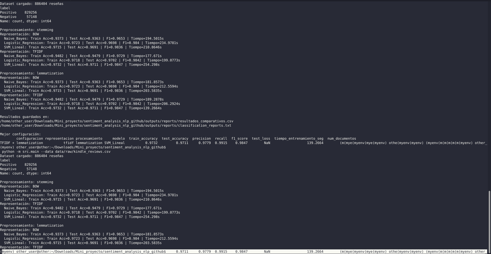
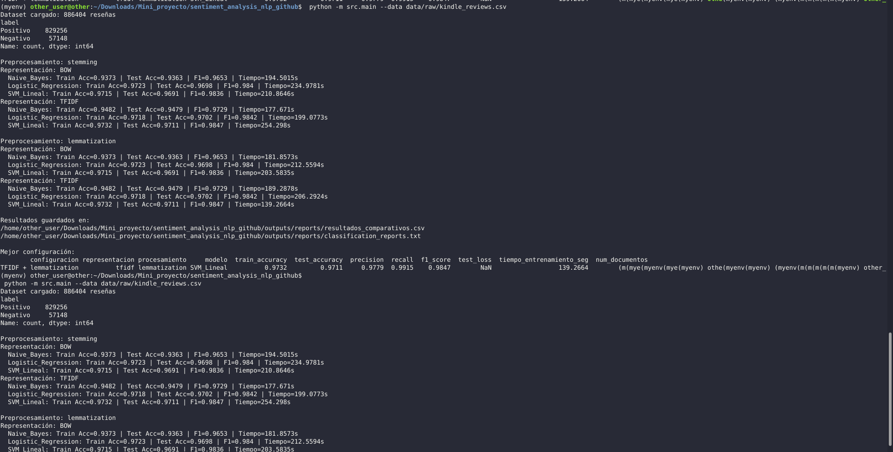
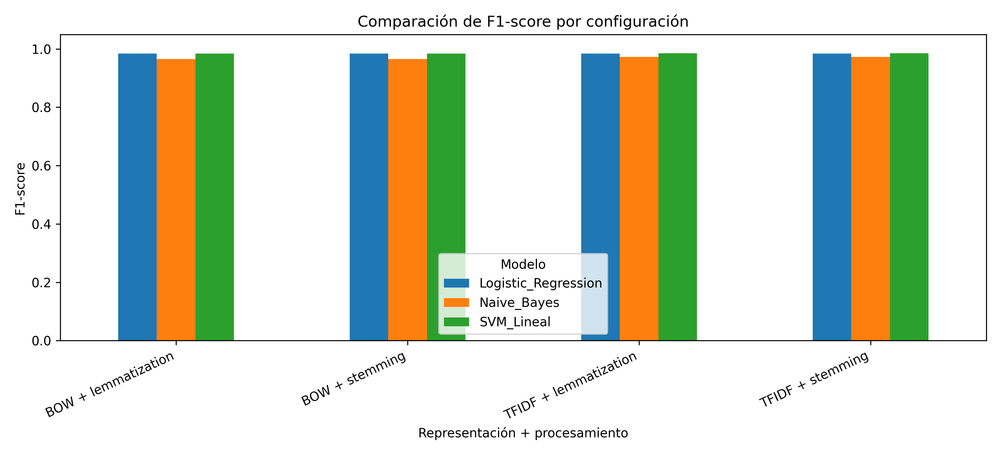
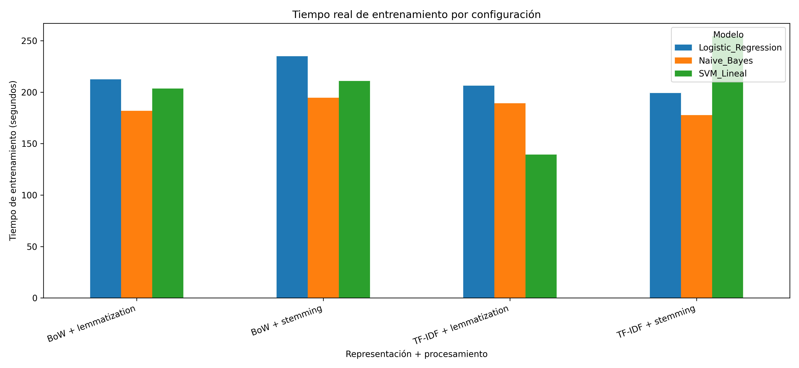

# Mini Proyecto: Sistema de Sentiment Analysis con NLP

**Materia:** Minería de Datos y Ciencia de Datos  
**Profesor:** M.C. Eduardo Francisco Sánchez Ocampo  
**Integrantes del equipo:**

- Pablo García Espejo
- Diego Arath Franco Herrera
- Miguel Ángel Guerrero Alvarez
- Manuel de la Torre
- Giulian Thibaut Elías-Libera

**Fecha:** 19 de febrero de 2026

---

## Enlaces de entrega

En caso de que no se puedan apreciar correctamente los archivos dentro del repositorio, también se puede acceder al contenido desde los siguientes enlaces:

**Video presentación:**  
https://drive.google.com/file/d/19UyteEVHDn6D3hP5Xpebxyk8N1pCNtqi/view?usp=sharing

**Reporte:**  
https://drive.google.com/file/d/1MLQuLCaDFAXmqXnyJ4srE7LlYpcMZ81A/view?usp=drive_link

**Presentación:**  
https://drive.google.com/file/d/1PaGRIaY3WlA3bMl8apvbDUdwQSH3yDJN/view?usp=drive_link

**Drive:**  
https://drive.google.com/drive/folders/1Wvi1d3FDzKuR1Ua-TXTCoZ5hsnXe3hFd?usp=sharing

---

## 1. Objetivo del proyecto

El objetivo del mini proyecto es construir un sistema completo de **Sentiment Analysis** utilizando técnicas de **Natural Language Processing**.

El sistema procesa reseñas de texto, las transforma en representaciones numéricas y entrena modelos de Machine Learning para clasificar automáticamente el sentimiento expresado en una reseña como:

- **Positivo**
- **Negativo**

El proyecto cubre el flujo completo de un sistema NLP:

- carga del dataset
- exploración inicial de datos
- limpieza de texto
- tokenización
- eliminación de stopwords
- stemming
- lemmatization
- representación vectorial con Bag of Words
- representación vectorial con TF-IDF
- entrenamiento de modelos de clasificación
- evaluación de modelos
- comparación de resultados
- documentación del uso de IA

---

## 2. Dataset utilizado

**Dataset:** Amazon Reviews: Kindle Store Category  
**Fuente:** Kaggle  
**Link:** https://www.kaggle.com/datasets/bharadwaj6/kindle-reviews

El dataset contiene reseñas de usuarios sobre productos de la categoría Kindle Store de Amazon. Las reseñas incluyen texto escrito por usuarios y una calificación numérica.

Para este proyecto, el problema se plantea como clasificación binaria:

| Calificación original | Tratamiento | Etiqueta final |
|---:|---|---:|
| 4 o 5 | reseña positiva | 1 |
| 1 o 2 | reseña negativa | 0 |
| 3 | se elimina por ser neutral | no aplica |

### Tamaño usado en la ejecución real

La ejecución real se hizo con el archivo:

```text
data/raw/kindle_reviews.csv
```

Resumen mostrado en terminal:

| Clase | Cantidad |
|---|---:|
| Positivo | 829,256 |
| Negativo | 57,148 |
| Total | 886,404 |

El dataset queda desbalanceado porque hay muchas más reseñas positivas que negativas. Por eso se revisa F1-score además de accuracy.

---

## 3. Estructura del repositorio

```text
sentiment-analysis-kindle-nlp/
├── .github/
│   └── workflows/
│       └── ci.yml
├── data/
│   ├── raw/
│   │   └── .gitkeep
│   └── sample/
│       └── kindle_reviews_sample.csv
├── docs/
│   ├── evidencias/
│   ├── presentacion/
│   │   ├── presentacion_sentiment_analysis_beamer.tex
│   │   └── presentacion_sentiment_analysis.pdf
│   └── reporte/
│       ├── reporte_sentiment_analysis.tex
│       └── reporte_sentiment_analysis.pdf
├── outputs/
│   ├── figures/
│   │   ├── comparacion_f1_score.png
│   │   ├── comparacion_tiempo_entrenamiento.png
│   │   ├── evidencia_ejecucion_resultados_reales_1.png
│   │   └── evidencia_ejecucion_resultados_reales_2.png
│   └── reports/
│       ├── classification_reports.txt
│       ├── resultados_comparativos.csv
│       └── resultados_comparativos.md
├── referencia_clase/
│   └── nlp_base_clase.py
├── src/
│   ├── __init__.py
│   ├── config.py
│   ├── data_loader.py
│   ├── evaluate.py
│   ├── main.py
│   ├── modeling.py
│   ├── predict.py
│   └── preprocessing.py
├── tests/
│   ├── test_data_loader.py
│   └── test_preprocessing.py
├── .gitignore
├── LICENSE
├── MiniProyecto3_Sentiment_Analysis_NLP.ipynb
├── README.md
└── requirements.txt
```

---

## 4. Descripción general del sistema

El sistema sigue este flujo:

1. Carga el dataset.
2. Detecta la columna de texto y la columna de calificación.
3. Convierte calificaciones en etiquetas binarias.
4. Limpia el texto.
5. Tokeniza las reseñas.
6. Elimina stopwords.
7. Aplica stemming o lemmatization.
8. Convierte texto a vectores usando BoW o TF-IDF.
9. Divide los datos en train y test.
10. Entrena modelos de clasificación.
11. Calcula métricas.
12. Guarda resultados, reportes y gráficas.

---

## 5. Preprocesamiento NLP implementado

El archivo principal del preprocesamiento es:

```text
src/preprocessing.py
```

El código realiza:

- conversión a minúsculas
- eliminación de URLs
- eliminación de etiquetas HTML
- eliminación de signos de puntuación
- eliminación de números
- eliminación de caracteres especiales
- eliminación de espacios repetidos
- tokenización
- eliminación de stopwords
- stemming
- lemmatization

El proyecto toma como base la idea vista en clase con NLTK: tokenización, stopwords, stemming, lemmatization, BoW, TF-IDF y Word2Vec. El archivo de referencia está en:

```text
referencia_clase/nlp_base_clase.py
```

---

## 6. Representación vectorial del texto

### 6.1 Bag of Words

Bag of Words representa cada reseña mediante la frecuencia de las palabras del vocabulario.

Ventajas:

- es simple
- es interpretable
- funciona como línea base

Limitaciones:

- no conserva el orden de las palabras
- no captura significado semántico
- genera matrices dispersas
- da mucho peso a palabras frecuentes aunque no siempre sean importantes

### 6.2 TF-IDF

TF-IDF asigna peso a una palabra según su frecuencia en un documento y su rareza en todo el corpus.

Ventajas:

- reduce el peso de palabras comunes
- resalta términos más informativos
- mejora la separación entre documentos
- funciona bien en clasificación de texto

---

## 7. Modelos de clasificación implementados

| Modelo | Descripción |
|---|---|
| Naive Bayes | Modelo probabilístico rápido y común en clasificación de texto. |
| Logistic Regression | Modelo lineal fuerte para clasificación binaria. |
| SVM lineal | Modelo basado en margen, útil en espacios de alta dimensión. |

---

## 8. Experimentos realizados

El pipeline ejecuta 12 combinaciones:

| Procesamiento | Vectorización | Modelos |
|---|---|---|
| Stemming | BoW | Naive Bayes, Logistic Regression, SVM lineal |
| Stemming | TF-IDF | Naive Bayes, Logistic Regression, SVM lineal |
| Lemmatization | BoW | Naive Bayes, Logistic Regression, SVM lineal |
| Lemmatization | TF-IDF | Naive Bayes, Logistic Regression, SVM lineal |

---

## 9. Resultados reales obtenidos

El comando ejecutado fue:

```bash
python -m src.main --data data/raw/kindle_reviews.csv
```

### Tabla comparativa

| Configuración | Modelo | Train Acc | Test Acc | F1-score | Tiempo (s) |
|---|---|---:|---:|---:|---:|
| BoW + stemming | Naive Bayes | 0.9373 | 0.9363 | 0.9653 | 194.5015 |
| BoW + stemming | Logistic Regression | 0.9723 | 0.9698 | 0.9840 | 234.9781 |
| BoW + stemming | SVM lineal | 0.9715 | 0.9691 | 0.9836 | 210.8646 |
| TF-IDF + stemming | Naive Bayes | 0.9482 | 0.9479 | 0.9729 | 177.6710 |
| TF-IDF + stemming | Logistic Regression | 0.9718 | 0.9702 | 0.9842 | 199.0773 |
| TF-IDF + stemming | SVM lineal | 0.9732 | 0.9711 | 0.9847 | 254.2980 |
| BoW + lemmatization | Naive Bayes | 0.9373 | 0.9363 | 0.9653 | 181.8573 |
| BoW + lemmatization | Logistic Regression | 0.9723 | 0.9698 | 0.9840 | 212.5594 |
| BoW + lemmatization | SVM lineal | 0.9715 | 0.9691 | 0.9836 | 203.5835 |
| TF-IDF + lemmatization | Naive Bayes | 0.9482 | 0.9479 | 0.9729 | 189.2878 |
| TF-IDF + lemmatization | Logistic Regression | 0.9718 | 0.9702 | 0.9842 | 206.2924 |
| TF-IDF + lemmatization | SVM lineal | 0.9732 | 0.9711 | 0.9847 | 139.2664 |

Archivo completo:

```text
outputs/reports/resultados_comparativos.csv
```

### Mejor configuración

| Campo | Valor |
|---|---:|
| Representación | TF-IDF |
| Procesamiento | Lemmatization |
| Modelo | SVM lineal |
| Train Accuracy | 0.9732 |
| Test Accuracy | 0.9711 |
| Precision | 0.9779 |
| Recall | 0.9915 |
| F1-score | 0.9847 |
| Tiempo | 139.2664 s |

### Evidencia de ejecución real





### Comparación de F1-score



### Comparación de tiempos



### Nota sobre matrices de confusión

El código genera matrices de confusión automáticamente en `outputs/figures/` cada vez que se ejecuta el pipeline. En este paquete se incluyen las evidencias de terminal y las gráficas comparativas construidas con los resultados reales que fueron compartidos. Si se desea incluir las matrices exactas de la corrida real, se deben copiar desde la carpeta `outputs/figures/` generada en la computadora donde se ejecutó el dataset completo.

---

## 10. Análisis comparativo

### 10.1 BoW vs TF-IDF

TF-IDF tuvo el mejor resultado cuando se combinó con SVM lineal. BoW también obtuvo resultados altos, pero TF-IDF mejora la ponderación de términos porque reduce el efecto de palabras demasiado frecuentes.

### 10.2 Stemming vs Lemmatization

Con BoW, stemming y lemmatization entregaron resultados prácticamente iguales. Con TF-IDF, ambas técnicas tuvieron el mismo F1-score máximo, pero la combinación TF-IDF + lemmatization + SVM lineal fue más rápida en la ejecución registrada.

### 10.3 Comparación de modelos

Naive Bayes fue el modelo más simple y mantuvo buen desempeño. Logistic Regression mejoró claramente frente a Naive Bayes. SVM lineal obtuvo el mejor F1-score y la mejor configuración final.

### 10.4 Problema detectado en el dataset

El dataset está desbalanceado. Hay 829,256 reseñas positivas y 57,148 negativas. Por esa razón, accuracy no basta para evaluar el modelo. F1-score resulta más útil porque integra precision y recall.

---

## 11. Cómo ejecutar el proyecto

### Crear ambiente virtual

```bash
python -m venv .venv
```

En Windows:

```bash
.venv\Scripts\activate
```

En macOS o Linux:

```bash
source .venv/bin/activate
```

### Instalar dependencias

```bash
pip install -r requirements.txt
```

### Ejecutar con dataset real

Guarda el CSV como:

```text
data/raw/kindle_reviews.csv
```

Ejecuta:

```bash
python -m src.main --data data/raw/kindle_reviews.csv
```

### Ejecutar con dataset de muestra

```bash
python -m src.main --data data/sample/kindle_reviews_sample.csv
```

El dataset de muestra solo sirve para verificar que el proyecto corre. No sustituye el dataset real.

### Ejecutar desde notebook

Abre este archivo:

```text
MiniProyecto3_Sentiment_Analysis_NLP.ipynb
```

---

## 12. Pruebas automáticas

```bash
pytest -q
```

Las pruebas revisan:

- carga del dataset de muestra
- existencia de etiquetas 0 y 1
- limpieza básica de texto
- salida válida del preprocesamiento

---

## 13. Documentación del uso de IA

### Qué código fue generado o apoyado con IA

Se usó IA como apoyo para:

- organizar la estructura del repositorio
- proponer funciones auxiliares de carga, limpieza y evaluación
- redactar la documentación base
- revisar que el proyecto incluyera todos los puntos de la rúbrica

### Por qué se utilizó IA

Se usó IA para acelerar la organización inicial y reducir omisiones en la rúbrica. El equipo ejecutó el proyecto, revisó los resultados y validó el comportamiento del pipeline.

### Porcentaje estimado de código asistido por IA

El porcentaje estimado se mantiene por debajo del 30%.

### Pruebas realizadas

- ejecución con dataset de muestra
- ejecución con dataset real de 886,404 reseñas
- generación de `resultados_comparativos.csv`
- generación de gráfica comparativa de F1-score
- generación de reporte técnico y presentación

### Errores encontrados y correcciones

| Error encontrado | Corrección aplicada |
|---|---|
| El dataset real tarda mucho por su tamaño | Se limitó el vocabulario con `MAX_FEATURES = 5000`. |
| El dataset está desbalanceado | Se priorizó F1-score sobre accuracy. |
| La clase neutral genera ambigüedad | Se eliminaron reseñas con calificación 3. |
| Algunos modelos no tienen `predict_proba` | `test_loss` queda vacío cuando no aplica. |

---


## 14. Conclusiones

El proyecto implementa un pipeline completo de Sentiment Analysis. El sistema procesa reseñas, limpia texto, transforma palabras en vectores numéricos y entrena modelos supervisados para clasificar sentimientos.

La mejor configuración fue **TF-IDF + lemmatization + SVM lineal**, con **Test Accuracy = 0.9711** y **F1-score = 0.9847**. Este resultado indica que el modelo clasifica correctamente la mayoría de las reseñas y mantiene un buen balance entre precision y recall.

TF-IDF fue una representación fuerte porque pondera mejor las palabras relevantes. SVM lineal fue el mejor modelo porque trabaja bien con vectores dispersos y de alta dimensión. El principal problema detectado fue el desbalance de clases, ya que las reseñas positivas superan ampliamente a las negativas.

---

## 15. Referencias

Bird, S., Klein, E., & Loper, E. (2009). *Natural language processing with Python*. O'Reilly Media.

Manning, C. D., Raghavan, P., & Schütze, H. (2008). *Introduction to information retrieval*. Cambridge University Press.

Pedregosa, F., Varoquaux, G., Gramfort, A., Michel, V., Thirion, B., Grisel, O., Blondel, M., Prettenhofer, P., Weiss, R., Dubourg, V., Vanderplas, J., Passos, A., Cournapeau, D., Brucher, M., Perrot, M., & Duchesnay, É. (2011). Scikit-learn: Machine learning in Python. *Journal of Machine Learning Research, 12*, 2825-2830.

Srivastava, B. (s. f.). *Amazon reviews: Kindle Store Category*. Kaggle. https://www.kaggle.com/datasets/bharadwaj6/kindle-reviews
